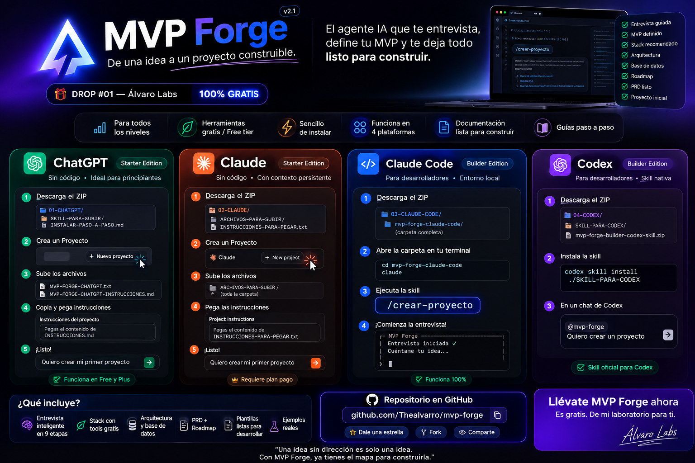

<div align="center">



# MVP Forge

**De una idea a un proyecto construible.**

DROP #01 — Álvaro Labs · v2.1 · 100% gratis

[Descargar MVP Forge](https://github.com/Thealvarro/mvp-forge/releases/latest/download/MVP-Forge-DROP-01.zip) · [Empezar](MVP-Forge-DROP-01/00-EMPIEZA-AQUI.md) · [Ver un ejemplo real](MVP-Forge-DROP-01/EJEMPLOS/reserva-de-horas-peluqueria.md)

</div>

---

## Qué es

MVP Forge es un agente de IA que te entrevista para convertir una idea vaga en un MVP definido.

Tú le cuentas qué quieres crear, como se lo contarías a un amigo. Él te va preguntando de a una y al final te entrega la documentación completa de tu proyecto: qué construir, para quién, con qué herramientas, cuánto cuesta y en qué orden.

**No programa el software.** Te dice qué programar, que es justo donde se atasca casi todo el mundo.

## Para quién sirve

- Tienes una idea dando vueltas hace meses y no sabes por dónde partir.
- Empezaste a construir algo y se te fue de las manos.
- Le pides código a una IA pero no sabes qué pedirle exactamente.
- Desarrollas hace años y quieres bajar un proyecto a documentación en una tarde.

No necesitas saber programar para usarlo.

## Qué hace

Una entrevista de 9 etapas: idea y problema → usuarios → alcance del MVP → funcionalidades → stack → arquitectura → base de datos → roadmap → entrega.

Y al final, estos 10 documentos:

| Documento | Qué contiene |
|---|---|
| `01-resumen.md` | Qué es y qué problema resuelve |
| `02-usuarios.md` | Para quién es y quién paga |
| `03-mvp.md` | V1 imprescindible / Después de validar / Futuro |
| `04-funcionalidades.md` | Cada función con su criterio de terminado |
| `05-stack.md` | Herramientas, costo real y límites del plan gratis |
| `06-arquitectura.md` | Cómo se conecta todo |
| `07-base-de-datos.md` | Qué se guarda y quién puede verlo |
| `08-roadmap.md` | Fases, y una sola próxima fase |
| `PRD.md` | Todo junto, para leer o compartir |
| `INICIAR-DESARROLLO.md` | Prompt listo para empezar a construir |

### Tres cosas que hace distinto

**Una pregunta a la vez.** No es un formulario de 40 campos. La siguiente pregunta depende de lo que respondiste, así que la conversación se adapta a tu proyecto.

**Te frena cuando te entusiasmas.** Cuando empiezas a sumar funciones, para, te muestra la lista completa y te obliga a elegir. Tiene permiso explícito para decirte *"eso lo dejaría fuera de V1"*. La mayoría de los MVPs no fracasan por falta de ideas: fracasan por exceso.

**La seguridad entra en la definición.** Si tu proyecto maneja cuentas o datos de personas, las reglas de acceso quedan escritas en el documento de base de datos. No en una lista de pendientes para después.

## Filosofía FREE-FIRST

MVP Forge intenta que empieces gastando **$0**, siempre que tenga sentido.

Cada vez que te recomienda una herramienta te explica:

1. Qué es
2. Para qué sirve en tu proyecto
3. Por qué encaja
4. Cuánto cuesta empezar
5. Qué límite del plan gratuito te va a importar
6. Cuándo probablemente tendrías que pagar
7. Qué alternativa gratuita o más barata existe

Dos reglas que lo hacen honesto: **no inventa cifras** — los planes gratuitos cambian seguido, así que te da el dato como referencia y te manda a confirmarlo en el sitio oficial. Y **te dice cuándo hay que pagar**, en vez de forzar una solución gratis que se va a caer en tres semanas.

A veces la recomendación más FREE-FIRST es que no construyas nada todavía: un formulario, una planilla y WhatsApp. Cuando ese es el caso, te lo dice.

## Starter y Builder

Es la misma entrevista con distinta entrega.

| | **Starter** | **Builder** |
|---|---|---|
| **Dónde** | ChatGPT · Claude | Claude Code · Codex |
| **Para** | Personas que no programan | Desarrolladores |
| **Cómo entrega** | Los 10 documentos como texto para copiar | Escribe los 10 archivos en `proyecto/` |
| **Lenguaje** | Explica cada término técnico | Directo, vocabulario del oficio |
| **Instalación** | Un Proyecto de ChatGPT o Claude | Una Skill en tu terminal |

## Cómo elegir tu plataforma

| Si usas… | Ve a | Necesitas |
|---|---|---|
| **ChatGPT** | [`01-CHATGPT`](MVP-Forge-DROP-01/01-CHATGPT/INSTALAR-PASO-A-PASO.md) | Cuenta gratis o Plus |
| **Claude.ai** | [`02-CLAUDE`](MVP-Forge-DROP-01/02-CLAUDE/INSTALAR-PASO-A-PASO.md) | Plan pago (los Proyectos lo requieren) |
| **Claude Code** | [`03-CLAUDE-CODE`](MVP-Forge-DROP-01/03-CLAUDE-CODE/INSTALAR-PASO-A-PASO.md) | Claude Code instalado |
| **Codex** | [`04-CODEX`](MVP-Forge-DROP-01/04-CODEX/INSTALAR-PASO-A-PASO.md) | Codex instalado |

**¿No sabes cuál?** Si nunca has creado software, ChatGPT. Si ya desarrollas, Claude Code.

No instales las cuatro. Elige una.

### Ojo con los planes gratuitos

MVP Forge es gratis. La IA donde lo usas, no siempre.

La entrevista son 9 etapas y toma una conversación larga. Los planes gratuitos de ChatGPT y Claude tienen un tope de mensajes por período: si lo alcanzas a mitad de camino, la conversación se detiene hasta que el límite se libere. Pasa, y es la interrupción más común.

**Lo ideal es hacerla con un plan pago** (ChatGPT Plus o Claude Pro): la terminas de una sola sesión, sin cortes. No es obligatorio — con cuenta gratis funciona igual, solo que puede tomarte dos sesiones.

Los topes cambian con frecuencia, así que no damos cifras: revísalos en el sitio oficial de cada plataforma.

**Si te corta a mitad de camino no pierdes el trabajo.** Antes de cerrar, pide esto:

```
Resume el estado del proyecto hasta ahora: qué etapas completamos y qué respondí en cada una.
```

Guarda ese resumen. Cuando el límite se libere, pégalo en un chat nuevo y escribe `Continuemos desde aquí`.

## Cómo comenzar

1. **[Descarga el ZIP](https://github.com/Thealvarro/mvp-forge/releases/latest/download/MVP-Forge-DROP-01.zip)** (87 KB). También puedes bajar el repositorio completo con el botón verde `Code → Download ZIP`.
2. **Descomprime** y abre `MVP-Forge-DROP-01/`.
3. **Elige tu carpeta** y sigue su `INSTALAR-PASO-A-PASO.md`.

Toma unos 5 minutos, una sola vez.

¿Quieres ver qué hace antes de instalar nada? Lee el [ejemplo completo](MVP-Forge-DROP-01/EJEMPLOS/reserva-de-horas-peluqueria.md): una idea de app de reservas convertida en proyecto, desde la primera pregunta hasta el último documento.

## Qué hay en este repositorio

```
MVP-Forge-DROP-01/
├── 00-EMPIEZA-AQUI.md      Empieza acá
├── 01-CHATGPT/             Starter para ChatGPT
├── 02-CLAUDE/              Starter para Claude
├── 03-CLAUDE-CODE/         Builder — Skill /crear-proyecto
├── 04-CODEX/               Builder — Agent Skill
├── PLANTILLAS/             Los 10 documentos en blanco
└── EJEMPLOS/               Un caso real completo
```

---

<div align="center">

### Álvaro Labs

Acá comparto primero las cosas que voy construyendo: agentes, skills, automatizaciones y herramientas.

**Este es el DROP #01. Vienen más.**

Si MVP Forge te sirvió, una ⭐ en el repo ayuda a que llegue a más gente.

Desarrollado por [SICS](https://alvarocofre.dev)

</div>
